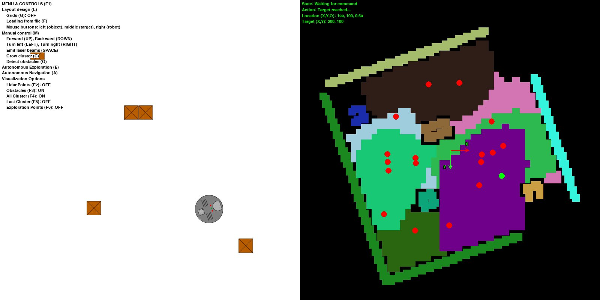
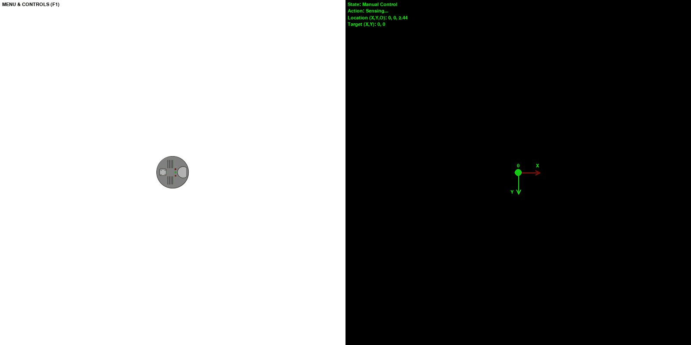
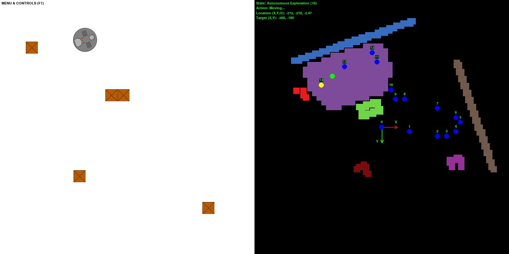
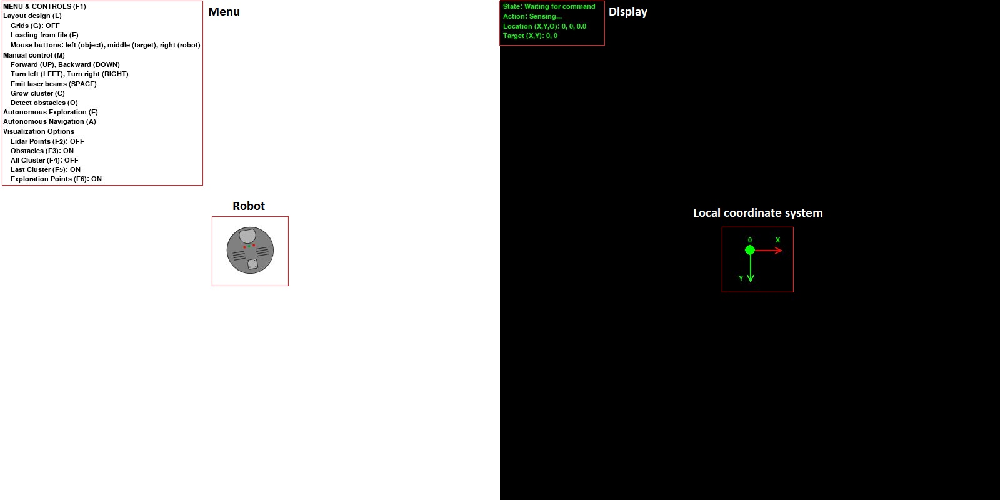
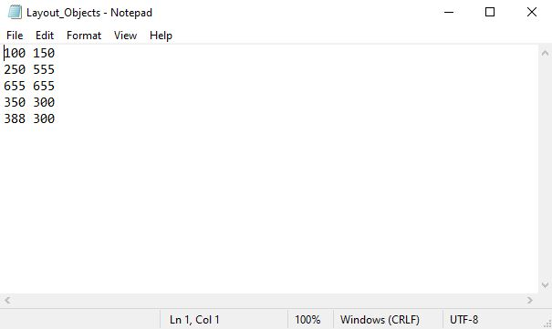

# Robot Topological Mapping by Adam

## Motivation
This application was created as my final project for [Harvard's CS50 course](https://online-learning.harvard.edu/course/cs50-introduction-computer-science?delta=0).

I wanted to learn something new and robotics seemed to be an interesting field. 
So, I looked some papers up, and the field of navigation & mapping seemed to have some challenges.
An interesting paper on topological mapping crossed my way: 
[Blochlinger et al (2017): Topomap: Topological Mapping and Navigation Based on Visual SLAM Maps](https://ieeexplore.ieee.org/document/8460641).
After reading the paper, I decided to make a small 2D simulation to implement this mapping approach with [Python](https://www.python.org/).

## Short description
In the simulation, there is one robot that tries to autonomously explore and navigate in its world. 
The world is a closed 800 by 800 px layout with square-shaped objects in it. 
The robot uses its sensor to explore the objects around itself and builds a map by using the sensor information.
In each step of the autonomous exploration the robot decides to which direction and how far to move.
When the autonomous exploration is completed, the robot builds a topological map with nodes for autonomous navigation.
During the autonomous navigation the robot creates a path from the starting point to the target point by using the [A* search algorithm](https://en.wikipedia.org/wiki/A*_search_algorithm).

A few words about the user interface. The main window shows two screens, see below:
* The layout with the main menu on the left side;
* The robot's map with a status display on the right side.

There are four main control modes:
* Layout design: this allows the user to create a layout interactively or load it from file.
* Manual control: this allows the user to manually control the robot. This was introduced to debug the program, so it has limited capabilities.
* Autonomous exploration: in this mode the robot makes a predefined amount of exploration step.
* Autonomous navigation: in this mode the robot navigates from its current location to the target location.

## Simulation components & settings
In this section we go through the simulation components, their working principles and settings.
### Robot
Let's start with the robot, shown below.

The robot's global position is initialized from the layout design, so the user can control it.
Contrary to this, the robot's orientation is always random.

The robot can move forwards, backwards. 
The robot's movement speed is defined in the *settings.py* file.
If the robot collides with and object, or it reached the perimeter of the layout it cannot move forward.

The robot can turn left and right. 
In manual mode this happens incrementally (5 degree). 
In autonomous modes, this happens continuously, however, the visualisation of the robot's orientation happens incrementally.
This means that if the robot's orientation is 24 degree then its image on the screen shows 25 degree orientation.

The robot uses its local coordinate system to define its position:
* The origin of the local coordinate system is always (0, 0). 
  This means that if the robot's initial global position on the layout is (400, 400), its position in the local coordinate system is (0, 0).
* The X-axis of the local coordinate system always defined by the initial orientation.

The robot uses odometry to keep track of its movement and orientation in the local coordinate system:
* We assume that the robot's odometry is **perfectly accurate**. 
  With other words there is no slip between the robot's wheels and the floor: 
  if the robot moves 1 meter in direction X then it ends up exactly 1 meter away in direction X.
* However, in autonomous mode there are tolerances:
  * A tolerance has to be set to define whether the robot's reached its current target position or not.
  This can be found in the *settings.py* file: robot_target_distance_tolerance
  * Similarly, a tolerance has to be set to define whether the robot is oriented into the right direction.
  This can be found in the *setting.py* file: robot_orientation_tolerance
  
The robot stores its current target position. It is also aware of being in the target position or not.

#### Sensor & laser beams
The robot uses its laser (LIDAR) sensor to detect objects. 

The sensor emits laser beams that are represented with small rectangular shapes. 
The following settings can be defined in the *settings.py* file:
* laser_color: the color of the laser beams
* laser_width / height: width and height of the rectangle
* laser_speed: moving speed of the laser beams
* laser_number: the total number of the emitted laser beams at once

Apart from this the there are sensor (LIDAR) settings in the *settings.py* file:
* lidar_view_angle: the view angle of the sensor
* lidar_sensing_distance: the maximum distance between the robot and laser beams

Based on the total number of laser beams and lidar's view angle the moving direction of each laser beam is calculated.
When the robot emits the laser beams they start to move away from the robot in the defined direction.
The distance between each laser beam and robot is continuously calculated:
* The further the beam from the robot the lighter its color is
* If the beam reached the maximum sensing distance then it is removed

If a laser beam hits an object or perimeter of the layout then we remove it, and the collision point is added to the map.

### Object
The objects are static elements on the layout. 
Their global position is initialized from the layout design, so the user can control it.

### Map
The robot's map is the heart of the program, and probably the most complex part.

The robot's map uses a grid system. The size of one grid cell can be changed by the map_cell_size settings in the *settings.py* file.
If the cell size is larger the simulation runs faster, but the map is less accurate.
If the cell size is smaller the map is more accurate, but the simulation runs longer.
The following cell sizes were tested: 4, 8, 12, 16 & 20.

The map contains the following main elements:
* Lidar detection points: these are collision points of the laser beams.
* Obstacles: collection of grid cells that cover lidar detection points that belong to each other.
* Trajectory points: the points where the robot sensed its surroundings.
* Clusters: list of clusters.

The map continuously changes its scale as new lidar detection points are added to it.

The map's visualisation settings can be found in the *settings.py* file:
* map_font_size: font size on the map
* map_target_size: size of the targets
* map_navigation_rect_size: size of the navigation nodes
* map_color: background color of the map
* map_lidar_color: color of the lidar detection points
* map_robot_position_color: color of the point that represents the robot's actual position
* map_old_exp_point_color = color of the passed target points in autonomous exploration mode
* map_new_exp_point_color = current target point color in autonomous exploration mode
* map_navigation_node_color = color of the navigation nodes
* map_navigation_path_color = color of the navigation nodes along the navigation path in autonomous navigation mode
* map_navigation_target_color = color of the navigation target in autonomous navigation mode
* map_text_color = text color
* map_x_axis_color = color for the x-axis
* map_y_axis_color = color for the y-axis

#### Obstacles
The obstacles are grid cells that cover lidar detection points that belong to the same object.

The obstacle detection works in the following way:
1. We loop through the lidar detection points
1. The points that are adjacent and close to each other are collected in obstacles
1. The grid cells that cover all the lidar detection point within the obstacle are calculated
1. The same color is assigned to gird cells of the same obstacle

On the following figure, you can see that the two adjacent objects are detected as one obstacle.
All the obstacle cells has the same color.

#### Clusters
A cluster is a convex, compact shape that covers an area on the map in which the robot can freely move.

*Note 1*: Convex means that the cluster does not contain any obstacle cells.

*Note 2*: Compact means that one principal size of the cluster is not significantly larger than the other.

The cluster consists of grid cells. 
The cluster growing algorithm was implemented from [Blochlinger et al (2017): Topomap: Topological Mapping and Navigation Based on Visual SLAM Maps](https://ieeexplore.ieee.org/document/8460641) 
and it covers the following steps:
1. A new cluster is created with its center point (current location of the robot)
   * The color of the cluster cells is randomly chosen at the moment of initialization
1. The growing starts with one cell at the center point of the cluster
1. All adjacent cells around the perimeter of the cluster added to a list
1. Adjacent cells that are part of any obstacle removed from the list (convexity)
1. Performing principal component analysis (PCA) on the cluster
1. Adjacent cells that fall further from the center than the length of the smaller main axis multiplied by an aspect ratio are removed from the list (compactness)
   * The aspect ratio (map_cluster_aspect_ratio) can be set in the *settings.py* file
1. Adjacent cells that fall further than the pre-defined maximum distance (maximum lidar sensing distance) are removed
1. Creating rays between all adjacent cells and core cluster cells
1. Finding the rays that has intersection with any of the obstacle cells
1. Removing the adjacent cells that have intersecting rays from the list (convexity)
1. Adding the new cells to the cluster

An example is shown below! The puple cluster is limited by two three obstacles. 
The robot can freely move in this area since it does not contain any obstacle cells (convex).

### Autonomous exploration
The robot is capable to explore the layout autonomously.
This happens stepwise. 
The number of exploration steps (ae_exploration_steps) has to be defined in the *settings.py* file.

In each exploration step the following happens:
1. Autonomous sensing: the robot turn around and emits laser beams to explore its surroundings
    * The number of sensing event can be set by *lidar_sensing_counter* variable in *settings.py*
1. Detecting obstacles as it was previously described
1. Growing a cluster with center of the current robot location
1. Calculating a new exploration point
    1. Collecting all cells from the cluster that have a certain safety distance from its perimeter
        * The safety distance is the size of the robot multiplied by a safety value, this can be set by *ae_safety_zone_multiplier* in the *settings.py* file
    1. If the selector counter reached its limit (if we cannot find a new target point within X amount of selection (selector counter) then we adjust the requirements)
        1. Setting the selector counter to zero
        1. Increasing the deviation angle by an increment and decrease the preferred minimum distance by increment
        * The increment for the angle deviation can be set by *ae_angle_increment* in the *settings.py* file
        * The distance increment can be set by *ae_distance_increment* in the *settings.py* file
    1. Choosing one cell randomly
    1. Calculating the orientation angle to the current robot orientation based on the position of the chosen cell
    1. Calculating the distance between the robot and the chosen cell
    1. Check if the orientation angle is not larger than a preferred deviation from the robot's current orienatation angle, and the distance is larger than a preferred minimum distance
        1. If the cell fulfills the requirements then we found our new exploration target
           1. Sending the new target point to the robot & map
        1. If the cell does not fulfil the requirements then increasing the selector counter limit
        * The preferred deviation angle can be set by *ae_initial_angle* in the *settings.py* file
        * The minimum distance can be set by *ae_min_distance* in the *settings.py* file
1. Moving to the new exploration point
1. Repeating the previous steps until we run out of exploration steps

With the previous algorithm we secure the followings:
* The robot always moves within the cluster thanks to the safety distance from the cluster's perimeter
* The robot always prefers to move into a direction that falls close to its current direction
* The robot always tries to maximise the moving distance between the current and new positions

An exploration trajectory is shown below! 
You can see how the robot moved into a similar direction between the exploration points, e.g. from exploration point 24 to 29.
In the pink cluster, it is also visible how the robot maximized the distance between exploration point 28 and 29.

### Autonomous navigation
The robot is capable to navigate on the map autonomously.
To do so the robot simplifies the exploration map and creates navigation nodes.

When the autonomous exploration is completed the following algorithm takes place based on [Blochlinger et al (2017): Topomap: Topological Mapping and Navigation Based on Visual SLAM Maps](https://ieeexplore.ieee.org/document/8460641):
1. Merging clusters
    1. Creating a list with the initial clusters (copy from the clusters list)
    1. Creating a list for the merged clusters
    1. Creating a list with cluster pairs that have intersection
    1. Loop through the cluster pairs list
        1. If the clusters are on the initial cluster list
            1. Calculate the hull of the perimeter points of the two clusters by using the [quick hull algorithm](https://en.wikipedia.org/wiki/Quickhull)
            1. If none of the obstacle cells fall into the hull (convexity)
                1. Merging the two cluster
                1. Adding the merged cluster to the merged clusters list
                1. Removing the clusters from the initial clusters list 
    1. Replacing the clusters list with the merged clusters list
    1. Repeating until there is no change in the cluster numbers
1. Removing covered clusters
    1. Creating a list for the highly covered clusters
    1. Loop through the clusters
        1. Calculate total number of intersecting cells with other clusters
        1. If the cluster is highly covered by other clusters
            1. Adding it to the highly covered clusters list
            * The threshold for the highly covered clusters can be set by *map_coverage_threshold* in the *settings.py* file
    1. Removing the highly covered clusters
1. Finding cluster neighbours
    1. Loop through the clusters
        1. If there is intersection with another cluster
            1. The other cluster to the neighbouring clusters list
1. Creating navigation nodes
    1. Add the center of the cluster to the navigation nodes
    1. Loop through the neighbouring clusters
        1. Find the intersecting cells
        1. Calculate the center point of the intersecting region (portal point by [Blochlinger et al (2017): Topomap: Topological Mapping and Navigation Based on Visual SLAM Maps](https://ieeexplore.ieee.org/document/8460641))
        1. Add this point to the navigation nodes
    
At this point the robot has a simplified map with larger (merged) clusters and navigation nodes.
The next step is to define the path from the current location to the target points.
To do so, the following steps take place:
1. Finding the cluster that contains the starting point
1. Finding the cluster that contains the end point
1. If the starting cluster is the same as the target cluster
    1. Adding the end point to the path, we are done since we have to move within the same cluster
1. If the starting cluster is not the same as the target cluster
    1. Adding the start and end points to the start and end clusters
    1. Initializing the [A* search algorithm](https://en.wikipedia.org/wiki/A*_search_algorithm)
    1. Performing the [A* search algorithm](https://en.wikipedia.org/wiki/A*_search_algorithm)
    1. Extracting the moving path
    1. Removing the start and end points from the start and end cluster, since they do not belong there

When the robot knows the path to the target, we set the path points as a target for the robot one by one until the robot reaches the end point.

On the following figure, you can see how the number of clusters was decreased from the initial 30 (number of exploration steps) to 7 by merging clusters and removing the highly covered ones.
The red dots represent the navigation nodes that the robot can use to define the path from one location to another.

## User interface and controls
After the program is executed the startup screen shows up, see below! On the left side we can see the active menu and the robot in the center of the layout. 

By using the keyboard we can select control and visualisation option from the menu:
* F1: shows / hides the menu.
* L: activates the layout design mode
    * G: activates the grids if we are in the layout design mode. When the girds are activated, the objects jumps on the closest grids during creation.
    * F: loads the layout from file.
    * Mouse buttons:
        * Left-click on the layout area: creates a new object.
        * Middle-click on the layout area: creates a new target point (see later in the autonomous navigation section).
        * Right-click on the layout area: replaces the robot.
* M: activates the manual control mode
    * Arrows (UP, DOWN, LEFT, RIGHT): moves and rotates the robot.
    * SPACE: the robot emits laser beams.
    * C: the robot grows a cluster at its current location.
    * O: the robot detects the obstacles (points that form one obstacle entity).
* E: activates autonomous exploration.
* A: activates autonomous navigation.
* Visualization options:
    * F2: shows / hides the lidar points on the map.
    * F3: shows / hides the obstacles on the map.
    * F4: shows / hides all the clusters on the map.
    * F5: shows / hides the last explored cluster on the map.
    * F6: shows / hides the exploration points on the map.
  
On the right side we can see the empty map with the robot's local coordinate system and the display.
The display shows information about the robot:
* State, the current state of the robot:
    * Waiting for command: the robot waits for the next command
    * Manual control: the robot is in manual control mode
    * Autonomous exploration: the robot is in autonomous exploration mode
    * Autonomous navigation: the robot is in autonomous navigation mode
* Action, the current action of the robot:
    * Sensing: the robot uses its sensor to detect surrounding obstacles
    * Moving: the robot moves to the target point
    * Target reached: the robot reached its target
* Location, the location of the robot in its local coordinate system
    * X: x-coordinate
    * Y: y-coordinate
    * O: orientation to the X-axis
* Target, the current target of the robot in its local coordinate system
    * X: x-coordinate
    * Y: y-coordinate

### Layout design
When we enter into the layout design mode, it is shown in the menu with red fonts, see below.

**Reminder:** the origin of the layout (global coordinate system) is the top-left corner of the window. 
The x-axis goes from left to right. 
The y-axis goes from top to bottom.

#### Grids
When the grids option is active, then the objects snap to the closest grid. 
Otherwise, the object will be created right at the current position of the cursor. You can see an example below!

#### Loading from file
The positions of the objects and the robot can be stored in text files. 
In these files we have to define the X & Y coordinates of the objects, separated by whitespace: one line per object.
An example is shown below!

The file paths have to be defined in the *settings.py* file:
* layout_object_filename;
* layout_robot_filename.

### Manual control mode
This mode was implemented to make debugging easier, so its functionality is limited.
When this mode is active, its font color turns into red in the menu.

With the arrow key the movement of the robot can be controlled. Laser beams can be emitted by the SPACE button.

A cluster can be grown at the current location of the robot by the pushing the C button.

The obstacle detection can be activated by pushing the O button.

**Warning:** if you switch between the manual and autonomous modes the simulation can crash. 
The program is not designed to handle these type of actions.

### Autonomous exploration
In this mode the robot attempts to explore its world. This works in the following way:
1. The robot turns 360 degrees stepwise
    * 

## References
1. [Blochlinger et al (2017): Topomap: Topological Mapping and Navigation Based on Visual SLAM Maps](https://ieeexplore.ieee.org/document/8460641).

